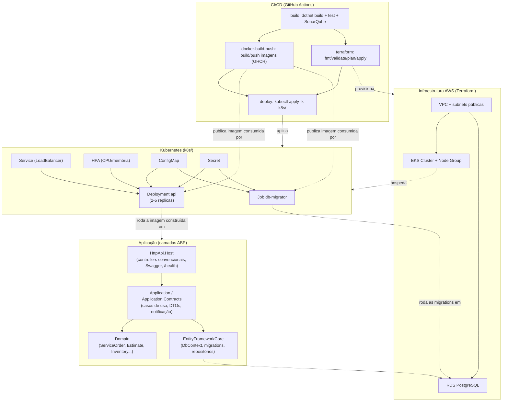

# Garage Management API 

## Sobre o projeto
Repositório reservado para o desenvolvimento de um MVP do back-end do sistema de uma oficina, com foco na gestão de ordens de serviço, clientes e peças.

---

## 🚀 Fase 2 — Evolução da aplicação e infraestrutura

A Fase 2 evolui o MVP da Fase 1 em duas frentes:

* **Aplicação**: refatoração orientada a Clean Code dentro da estrutura de camadas já existente
  (extração de portas/adapters de notificação, eliminação de duplicação, correção de consultas
  N+1) e as 5 APIs do ciclo de vida da Ordem de Serviço (OS):
  * **Abertura de OS** (`POST` no `service-order/open`) — recebe cliente, veículo, serviços e
    peças e retorna a OS já criada, com orçamento (`Estimate`) montado automaticamente.
  * **Consulta de status** — `GET` autenticado por id, ou consulta pública anônima por
    documento + placa (`service-order/public-status`), sem expor dados sensíveis.
  * **Aprovação/reprovação de orçamento** — `POST` em `estimate/{id}/approve` e
    `estimate/{id}/reject`, liberando/estornando reserva de estoque e propagando o status para a OS.
  * **Listagem de OS** — ordenada por prioridade de status (Em Execução > Aguardando Aprovação >
    Em Diagnóstico > Recebida, mais antigas primeiro) e excluindo, por padrão, OS Finalizadas e
    Entregues (exclusão lógica — continuam consultáveis individualmente).
  * **Atualização de status com notificação por e-mail** — ao mudar o status da OS para
    Aguardando Aprovação, Em Execução, Finalizada ou Entregue, o cliente recebe um e-mail
    automático (via a porta `IServiceOrderNotificationSender`).
* **Infraestrutura**: containerização revisada, manifestos Kubernetes para a aplicação real
  (antes só existia um placeholder de nginx), Terraform para VPC/EKS/RDS na AWS, e pipeline de
  CI/CD que builda, testa, publica imagens no GHCR e aplica a infraestrutura/deploy.

### Diagrama de arquitetura e fluxo de deploy



---

## 🧭 Arquitetura

O projeto segue o padrão **monolítico em camadas**, aplicando **Domain Driven Design (DDD)**.

## 🛠️ Tecnologias Utilizadas

* .NET (versão 8.0)
* ABP Framework (versão 8.3.0)
* Entity Framework Core
* Banco de dados relacional (PostgreSQL)
* Docker / Docker Compose
* Swagger (OpenAPI)
* xUnit (testes automatizados)
* Kubernetes (EKS) + Kustomize
* Terraform (AWS + HCP Terraform)
* GitHub Actions (CI/CD)


## 🗄️ Banco de Dados

**Banco escolhido:** 

[](#)

### Justificativa:

* [Open-source e amplamente utilizado](https://www.postgresql.org/about/)
* [Suporte a JSON (flexibilidade para evolução)](https://www.postgresql.org/docs/current/datatype-json.html)
* [Integração simples com Docker](https://hub.docker.com/_/postgres)
* [Compatível com EF Core](https://www.npgsql.org/efcore/?tabs=onconfiguring)

---

## 🔨 Execute o projeto

### 🔹 Pré-requisitos

* Docker
* Docker Compose

---

### ▶️ Passo a passo

1. Crie o arquivo de variáveis de ambiente
    * Copie o arquivo de exemplo:

        ```bash
        cp .env.example .env
        ```
        Edite o .env conforme necessário.

2. Suba o ambiente com Docker
    ```bash
    docker-compose up --build
    ```
    O docker-compose está configurado para:
    * Provisionar o banco de dados da aplicação
    * Aplicar as migrations garantindo o schema atualizado
    * Rodar data-seed com dados para testes
    * Subir a API pronta para uso

**Após subir os containers:**

* API disponível em:
  `http://localhost:8080` 

* Swagger:
  `http://localhost:8080/swagger`

---

## 🌍 Infraestrutura como Código (Terraform)

Os arquivos em `infra/` provisionam a infraestrutura AWS: VPC + 3 subnets públicas, cluster EKS
(1 node group, 2-3 nós `t3.medium`), banco RDS PostgreSQL (`db.t3.micro`, single-AZ) e as IAM
roles/security groups necessárias. O estado remoto usa **HCP Terraform** (workspace
`garage-management-api-dotnet` na organização `15soat-fiap`, ver `infra/backend.tf`).

### Pré-requisitos

* Conta AWS com permissões para criar VPC/EKS/RDS/IAM.
* Terraform >= 1.9.
* Um token de acesso à organização HCP Terraform (`TF_TOKEN_app_terraform_io`).

### Provisionar

```bash
cd infra
terraform init
terraform plan -var="db_password=<SENHA_FORTE>"
terraform apply -var="db_password=<SENHA_FORTE>"
```

Recursos criados (resumo): `aws_vpc`, `aws_subnet` (x3), `aws_internet_gateway`,
`aws_route_table`, `aws_security_group` (cluster e RDS), `aws_iam_role`/`aws_iam_role_policy_attachment`
(cluster e node group), `aws_eks_cluster`, `aws_eks_node_group`, `aws_eks_access_entry`,
`aws_db_subnet_group`, `aws_db_instance`, `aws_s3_bucket` (armazenamento auxiliar). Outputs
relevantes: `eks_cluster_name`, `rds_endpoint`, `rds_port`, `rds_database_name`.

### Destruir

```bash
terraform destroy -var="db_password=<SENHA_FORTE>"
```

---

## ☸️ Deploy em Kubernetes

Os manifestos em `k8s/` (aplicados via Kustomize) sobem a API, o Job de migração de banco, o
ConfigMap/Secret de configuração e o HorizontalPodAutoscaler no cluster EKS provisionado acima.

### Pré-requisitos

* Cluster já provisionado (`terraform apply` em `infra/`) e `kubectl` configurado para ele
  (`aws eks update-kubeconfig --name <eks_cluster_name> --region us-east-1`).
* Metrics Server instalado no cluster (necessário para o HPA calcular CPU/memória) — no EKS,
  instale com `kubectl apply -f https://github.com/kubernetes-sigs/metrics-server/releases/latest/download/components.yaml`.
* Imagens `api` e `db-migrator` publicadas em um registry acessível pelo cluster (o pipeline de
  CI/CD publica automaticamente no GHCR).

### Passo a passo (manual, fora do CI/CD)

1. Gere o Secret real a partir do template (nunca commitar valores reais):
   ```bash
   cp k8s/api/secret.example.yaml k8s/api/secret.yaml
   # edite k8s/api/secret.yaml com a connection string real (host/porta/senha do RDS) e a
   # passphrase de criptografia, depois:
   kubectl apply -f k8s/api/secret.yaml
   ```
2. Substitua os placeholders de imagem pelos valores reais publicados no registry:
   ```bash
   sed -i "s|API_IMAGE|ghcr.io/<owner>/<repo>-api:<tag>|" k8s/api/deployment.yaml
   sed -i "s|DB_MIGRATOR_IMAGE|ghcr.io/<owner>/<repo>-db-migrator:<tag>|" k8s/db-migrator/job.yaml
   ```
3. Aplique os manifestos:
   ```bash
   kubectl apply -k k8s/
   kubectl rollout status deployment/api -n garage-management
   ```
4. Acompanhe o autoscaling:
   ```bash
   kubectl get hpa -n garage-management --watch
   ```

O CI/CD (job `deploy` em `.github/workflows/build.yml`) automatiza os 3 primeiros passos a cada
push em `master`, assim que os secrets abaixo estiverem configurados no repositório.

---

## 📋 Documentação da API

A API está documentada utilizando **Swagger (OpenAPI)**.

1. Acesse:

    ```
    http://localhost:8080/swagger
    ```
2. Autentique: 
* Através do botão *Authorize* 
* Insira as credenciais presentes no `.env` para logar com o usuário **admin** *(ou crie um novo usuário)*
    ```
    IdentityClients__Default__UserName=
    IdentityClients__Default__UserPassword=
    ```

Através do swagger você pode:

* Visualizar endpoints
* Testar requisições
* Entender contratos de entrada/saída

---

## 🔬 Testes Automatizados

O projeto possui testes automatizados com foco nos **domínios críticos**.

[](https://sonarcloud.io/summary/new_code?id=kmlyteixeira_garage-management-api-dotnet)

### ▶️ Executar testes

```bash
dotnet test
```

---

## 🔍 Análise de Vulnerabilidades (OWASP ZAP)

O projeto possui uma configuração para realizar a análise de vulnerabilidades localmente.

**Arquivos relacionados:**

`docker-compose.scan.yml`

`security\run-security-scan.ps1`

`security\zap-config.conf`

### ▶️ Executar scanner

```bash
powershell -ExecutionPolicy Bypass -File security/run-security-scan.ps1
```

* O resultado da execução será gerado em dois formatos: HTML e JSON.
* Caminho para visualizar o resultado do scan: `garage-management-api-dotnet\reports\security`

---

## 📁 Estrutura do Projeto

```
docs/                                           <!-- Documentação DDD -->
└── architecture/
    ├── domain-storytelling
    ├── event-storming
    └── glossary
security/                                       <!-- Scripts para execução do OWASP ZAP via docker -->
reports/                                        <!-- Resultado da execução da análise de vulnerabilidades -->
└── security/
infra/                                          <!-- Terraform: VPC, EKS, RDS, IAM (Fase 2) -->
k8s/                                             <!-- Manifestos Kubernetes: api, db-migrator, HPA (Fase 2) -->
├── api/
└── db-migrator/
src/
├── GarageManagement.Application/              <!-- Orquestra os casos de uso da aplicação, coordenando regras de negócio -->
├── GarageManagement.Application.Contracts/    <!-- Define interfaces e DTOs que expõem os contratos da aplicação -->
├── GarageManagement.Domain/                   <!-- Contém as entidades e regras de negócio centrais do sistema -->
│   └── Entities
├── GarageManagement.Domain.Shared/            <!-- Armazena enums, constantes e definições compartilhadas -->
├── GarageManagement.EntityFrameworkCore/      <!-- Implementa a persistência e integração com o banco de dados -->
│   └── EntityFrameworkCore
│       ├── Configurations                    <!-- Define o mapeamento entre entidades e tabelas -->
│       └── Migrations                        <!-- Controla a evolução do schema do banco de dados -->
├── GarageManagement.HttpApi/                  <!-- Expõe os endpoints REST da aplicação via controllers -->
├── GarageManagement.HttpApi.Client/
├── GarageManagement.HttpApi.Host/             <!-- Configura e inicializa a aplicação (middlewares, DI, etc.) -->
└── GarageManagement.DbMigrator/               <!-- Executa migrations e garante a atualização do banco de dados -->

test/                                           <!-- Testes unitários e Testes de Integração -->
```
---

## 📃 Documentações

1️⃣ [Event Storming](https://github.com/kmlyteixeira/garage-management-api-dotnet/tree/master/docs/architecture/event-storming)

2️⃣ [Domain StoryTelling](https://github.com/kmlyteixeira/garage-management-api-dotnet/tree/master/docs/architecture/domain-storytelling)

3️⃣ [Dicionário Linguagem Ubíqua](https://github.com/kmlyteixeira/garage-management-api-dotnet/tree/master/docs/architecture/glossary)

4️⃣ [Relatório de Análise de Vulnerabilidades](https://github.com/kmlyteixeira/garage-management-api-dotnet/tree/master/reports/security)

## 🎥 Vídeo de demonstração (Fase 2)

TODO: Demonstração em vídeo (deploy da aplicação, execução do CI/CD, consumo das APIs e escalabilidade
automática via HPA)

## 📑 Referências

1️⃣ [ABP Framework](https://abp.io/get-started)

2️⃣ Documento de Especificação Tech Challenge 1ª Fase FIAP

3️⃣ Módulos 1ª Fase SOAT FIAP
