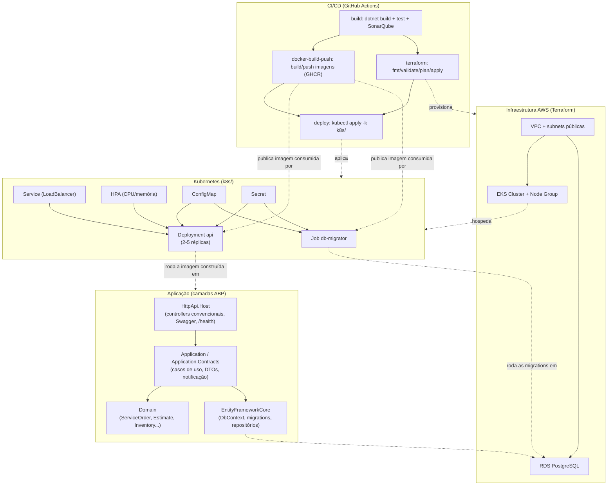

# Garage Management API

## Sobre o projeto
Repositório reservado para o desenvolvimento de um MVP do back-end do sistema de uma oficina, com foco na gestão de ordens de serviço, clientes e peças.

## Repositórios da solução

- [API principal e documentação central](https://github.com/kmlyteixeira/garage-management-api-dotnet)
- [Lambda de autenticação](https://github.com/kmlyteixeira/garage-management-lambda)
- [Infraestrutura AWS/Kubernetes](https://github.com/kmlyteixeira/garage-management-infra)
- [Infraestrutura do banco gerenciado](https://github.com/kmlyteixeira/garage-management-database)

Os quatro repositórios são partes da mesma solução e devem permanecer sincronizados por contratos versionados, Pull Requests e pipelines independentes.

## Estado da evolução cloud

- [ADRs, RFCs e arquitetura-alvo](docs/architecture)
- Terraform de database separado e validado com `terraform validate`.
- Terraform de plataforma/EKS/API Gateway separado e validado com `terraform validate`.
- Lambda inicial implementada e validada com `7` testes unitários.
- `Customer.IsActive` adicionado com migration [AddCustomerActiveStatus](src/GarageManagement.EntityFrameworkCore/EntityFrameworkCore/Migrations/20260908205547_AddCustomerActiveStatus.cs).
- Terraform, workflows, manifests, API Gateway condicional, Lambda e documentação estão configurados. O provisionamento/deploy depende dos secrets e approvals dos ambientes AWS.
- Logs da API são emitidos em JSON compacto para stdout; `OTEL_EXPORTER_OTLP_ENDPOINT` permanece configurável por ambiente.

## Sumário

- [Fase 2 - Evolução da aplicação e infraestrutura](#fase-2--evolução-da-aplicação-e-infraestrutura)
- [Arquitetura](#arquitetura)
- [Tecnologias Utilizadas](#-tecnologias-utilizadas)
- [Banco de Dados](#-banco-de-dados)
- [Execute o projeto](#-execute-o-projeto)
- [Infraestrutura como Código (Terraform)](#-infraestrutura-como-código-terraform)
- [Deploy em Kubernetes](#-deploy-em-kubernetes)
- [Documentação da API](#-documentação-da-api)
- [Testes Automatizados](#-testes-automatizados)
- [Análise de Vulnerabilidades (OWASP ZAP)](#-análise-de-vulnerabilidades-owasp-zap)
- [Estrutura do Projeto](#-estrutura-do-projeto)
- [Documentações](#-documentações)
  - [RFCs](#rfcs)
  - [ADRs](#adrs)
- [Vídeo de demonstração](#-vídeo-de-demonstração)
- [Referências](#-referências)
- [Fase 3 - Evolução para operação corporativa](#fase-3---evolução-da-aplicação-para-operação-corporativa)
  - [Requisitos atendidos](#requisitos-atendidos)
  - [Autenticação e contrato das APIs](#autenticação-e-contrato-das-apis)
  - [Observabilidade](#observabilidade)
  - [Governança, branches e ambientes](#governança-branches-e-ambientes)
  - [Matriz de entrega](#matriz-de-entrega)

---

## Fase 2 — Evolução da aplicação e infraestrutura

A Fase 2 evolui o MVP da Fase 1 em duas frentes:

* **Aplicação**: refatoração orientada a Clean Code dentro da estrutura de camadas já existente
  (extração de portas/adapters de notificação, eliminação de duplicação, correção de consultas
  N+1) e as 5 APIs do ciclo de vida da Ordem de Serviço (OS):
  * **Abertura de OS** (`POST` no `service-order/open`) — recebe cliente, veículo, serviços e
    peças e retorna a OS já criada, com orçamento (`Estimate`) montado automaticamente.
  * **Consulta de status** — `GET` autenticado por id, ou consulta pública anônima por
    documento + placa (`service-order/public-status`), sem expor dados sensíveis.
  * **Aprovação/reprovação de orçamento** — `POST` em `estimate/{id}/approve` e
    `estimate/{id}/reject`, liberando/estornando reserva de estoque e propagando o status para a OS.
  * **Listagem de OS** — ordenada por prioridade de status (Em Execução > Aguardando Aprovação >
    Em Diagnóstico > Recebida, mais antigas primeiro) e excluindo, por padrão, OS Finalizadas e
    Entregues (exclusão lógica — continuam consultáveis individualmente).
  * **Atualização de status com notificação por e-mail** — ao mudar o status da OS para
    Aguardando Aprovação, Em Execução, Finalizada ou Entregue, o cliente recebe um e-mail
    automático (via a porta `IServiceOrderNotificationSender`).
* **Infraestrutura**: containerização revisada, manifestos Kubernetes para a aplicação real
  (antes só existia um placeholder de nginx), Terraform para VPC/EKS/RDS na AWS, e pipeline de
  CI/CD que builda, testa, publica imagens no GHCR e aplica a infraestrutura/deploy.

### Diagrama de arquitetura e fluxo de deploy



---

## 🧭 Arquitetura

O projeto segue o padrão **monolítico em camadas**, aplicando **Domain Driven Design (DDD)**.

## Fase 3 - Evolução da aplicação para operação corporativa

Esta solução atende ao objetivo de operação corporativa com quatro repositórios, CI/CD, autenticação serverless, API Gateway, Kubernetes, Terraform, PostgreSQL gerenciado e observabilidade. A arquitetura completa e as decisões permanentes estão em [docs/architecture](docs/architecture), incluindo diagramas de contexto, componentes, contêineres, sequência, ER, RFCs e ADRs.

### Requisitos atendidos

| Requisito | Implementação e evidência |
| --- | --- |
| API Gateway | AWS API Gateway HTTP em `garage-management-infra`, com rotas públicas, VPC Link, throttling e authorizer JWT. |
| Autenticação por CPF | `POST /auth` na Lambda valida CPF, consulta `Customer.IsActive` e emite JWT RSA. |
| Consulta JWKS | `GET /.well-known/jwks.json` permite validação da assinatura pelo gateway/API. |
| Rotas protegidas | `ANY /{proxy+}` usa issuer/audience e header `Authorization: Bearer`. |
| Serverless | Repositório e pipeline próprios em [garage-management-lambda](https://github.com/kmlyteixeira/garage-management-lambda). |
| Quatro repositórios | API, Lambda, plataforma Kubernetes/AWS e banco gerenciado com READMEs e workflows próprios. |
| Banco gerenciado | RDS PostgreSQL privado, criptografado, backup, snapshot final, SG restrito e proteção contra deleção. |
| Kubernetes | EKS, Deployment, Service, DbMigrator Job, ConfigMap, Secret e HPA em `k8s/`. |
| Escalabilidade | HPA por CPU/memória, réplicas mínimas e máximas configuráveis. |
| CI/CD | GitHub Actions para build/test/Sonar, imagens GHCR, Terraform e deploy Kubernetes. |
| Observabilidade | Logs JSON, correlação de requisições, healthcheck, OpenTelemetry configurável e métricas de API/EKS/Lambda/RDS. |
| Segurança | OIDC/IAM, secrets externos, JWT, menor privilégio, ZAP e ausência de CPF/token nos logs. |
| Documentação | Diagramas Mermaid/PlantUML, RFCs, ADRs, modelo ER, Swagger e instruções por repositório. |

### Autenticação e contrato das APIs

```http
POST /auth
Content-Type: application/json

{"cpf":"12345678901"}
```

Resposta de sucesso: `200` com `access_token`, `token_type=Bearer` e expiração de 15 minutos. CPF inválido retorna `400`; cliente inexistente ou inativo retorna `401`. O token deve ser enviado nas rotas protegidas:

```http
Authorization: Bearer <access_token>
```

Principais recursos da API: abertura e consulta de OS, consulta pública por documento/placa sem dados sensíveis, aprovação/reprovação de orçamento, listagem ordenada por prioridade, atualização de status e notificações de e-mail. O contrato navegável fica no Swagger do ambiente (`/swagger`) e os endpoints são expostos por `https://<api-gateway-host>` quando o ambiente estiver publicado.

### Observabilidade

- Logs estruturados em JSON para stdout, com `timestamp`, `level`, `service`, `environment`, `request_id`, `trace_id`, rota, status e duração.
- Não registrar CPF completo, JWT, senha, connection string, chave privada ou dados pessoais desnecessários.
- Healthcheck em `/health`; acompanhar uptime, latência p50/p95/p99, taxa de 4xx/5xx e disponibilidade do Load Balancer.
- Kubernetes: CPU, memória, reinícios, disponibilidade de réplicas, HPA e falhas do Job DbMigrator.
- Lambda/API Gateway: invocações, erros, duração, throttling, 4xx/5xx e latência.
- Banco: conexões, CPU, storage, IOPS, latência, backups e eventos de failover.
- Alertar falhas no processamento de OS, erro de integração de e-mail, timeout de banco e indisponibilidade da API.
- Dashboards devem mostrar volume diário de OS, tempo médio por Diagnóstico/Execução/Finalização e erros de integrações. O endpoint OTLP é configurado por `OTEL_EXPORTER_OTLP_ENDPOINT`.

### Governança, branches e ambientes

- `develop`: homologação; `main`: produção.
- `main`/`master` protegida contra push direto, exigindo Pull Request, revisão, checks obrigatórios e resolução de conversas.
- Workflows CI executam em Pull Requests; deploy de homologação e produção exige Environment protegido e aprovação quando aplicável.
- Secrets obrigatórios ficam no GitHub Environment/AWS Secrets Manager, nunca no código: `AWS_ACCESS_KEY_ID`/OIDC, `AWS_SECRET_ACCESS_KEY` quando necessário, `TF_API_TOKEN`, `DB_PASSWORD`, `STRING_ENCRYPTION_PASSPHRASE`, `JWT_PUBLIC_KEY`, `SMTP_USERNAME` e `SMTP_PASSWORD`.
- Valores locais aleatórios para desenvolvimento, não para produção:

```text
DB_PASSWORD=Gm9!rT4#vQ7@pL2
STRING_ENCRYPTION_PASSPHRASE=dev-only-8Fq2-Mx7L-pR4V
IdentityClients__Default__UserName=admin
IdentityClients__Default__UserPassword=DevOnly!7mQ2#xP9
OTEL_EXPORTER_OTLP_ENDPOINT=http://localhost:4317
```

### Matriz de entrega

| Entregável | Local |
| --- | --- |
| API, Dockerfiles, testes e Swagger | Este repositório |
| Lambda e testes | [garage-management-lambda](https://github.com/kmlyteixeira/garage-management-lambda) |
| EKS, API Gateway e Terraform | [garage-management-infra](https://github.com/kmlyteixeira/garage-management-infra) |
| RDS PostgreSQL e Terraform | [garage-management-database](https://github.com/kmlyteixeira/garage-management-database) |
| Diagrama de componentes | [component.puml](docs/architecture/component.puml) |
| Diagrama de sequência | [sequence.puml](docs/architecture/sequence.puml) |
| Modelo ER | [er-model.puml](docs/architecture/er-model.puml) |
| RFCs | [docs/architecture/rfc](docs/architecture/rfc) |
| ADRs | [docs/architecture/adr](docs/architecture/adr) |
| Relatório OWASP ZAP | [reports/security](reports/security) |
| Vídeo de até 15 minutos |  |

## 🛠️ Tecnologias Utilizadas

* .NET (versão 8.0)
* ABP Framework (versão 8.3.0)
* Entity Framework Core
* Banco de dados relacional (PostgreSQL)
* Docker / Docker Compose
* Swagger (OpenAPI)
* xUnit (testes automatizados)
* Kubernetes (EKS) + Kustomize
* Terraform (AWS + HCP Terraform)
* GitHub Actions (CI/CD)


## 🗄️ Banco de Dados

**Banco escolhido:** 

[](#)

### Justificativa:

* [Open-source e amplamente utilizado](https://www.postgresql.org/about/)
* [Suporte a JSON (flexibilidade para evolução)](https://www.postgresql.org/docs/current/datatype-json.html)
* [Integração simples com Docker](https://hub.docker.com/_/postgres)
* [Compatível com EF Core](https://www.npgsql.org/efcore/?tabs=onconfiguring)

---

## 🔨 Execute o projeto

### 🔹 Pré-requisitos

* Docker
* Docker Compose

---

### ▶️ Passo a passo

1. Crie o arquivo de variáveis de ambiente
    * Copie o arquivo de exemplo:

        ```bash
        cp .env.example .env
        ```
        Edite o .env conforme necessário.

2. Suba o ambiente com Docker
    ```bash
    docker-compose up --build
    ```
    O docker-compose está configurado para:
    * Provisionar o banco de dados da aplicação
    * Aplicar as migrations garantindo o schema atualizado
    * Rodar data-seed com dados para testes
    * Subir a API pronta para uso

**Após subir os containers:**

* API disponível em:
  `http://localhost:8080` 

* Swagger:
  `http://localhost:8080/swagger`

---

## 🌍 Infraestrutura como Código (Terraform)

Os arquivos em `infra/` provisionam a infraestrutura AWS: VPC + 3 subnets públicas, cluster EKS
(1 node group, 2-3 nós `t3.medium`), banco RDS PostgreSQL (`db.t3.micro`, single-AZ) e as IAM
roles/security groups necessárias. O estado remoto usa **HCP Terraform** (workspace
`garage-management-api-dotnet` na organização `15soat-fiap`, ver `infra/backend.tf`).

### Pré-requisitos

* Conta AWS com permissões para criar VPC/EKS/RDS/IAM.
* Terraform >= 1.9.
* Um token de acesso à organização HCP Terraform (`TF_TOKEN_app_terraform_io`).

### Provisionar

```bash
cd infra
terraform init
terraform plan -var="db_password=<SENHA_FORTE>"
terraform apply -var="db_password=<SENHA_FORTE>"
```

Recursos criados (resumo): `aws_vpc`, `aws_subnet` (x3), `aws_internet_gateway`,
`aws_route_table`, `aws_security_group` (cluster e RDS), `aws_iam_role`/`aws_iam_role_policy_attachment`
(cluster e node group), `aws_eks_cluster`, `aws_eks_node_group`, `aws_eks_access_entry`,
`aws_db_subnet_group`, `aws_db_instance`, `aws_s3_bucket` (armazenamento auxiliar). Outputs
relevantes: `eks_cluster_name`, `rds_endpoint`, `rds_port`, `rds_database_name`.

### Destruir

```bash
terraform destroy -var="db_password=<SENHA_FORTE>"
```

---

## ☸️ Deploy em Kubernetes

Os manifestos em `k8s/` sobem a API, o Job de migração de banco, o
ConfigMap/Secret de configuração e o HorizontalPodAutoscaler no cluster EKS provisionado acima.

### Pré-requisitos

* Cluster já provisionado (`terraform apply` em `infra/`) e `kubectl` configurado para ele
  (`aws eks update-kubeconfig --name <eks_cluster_name> --region us-east-1`).
* Metrics Server instalado no cluster (necessário para o HPA calcular CPU/memória). O workflow de
  deploy instala isso automaticamente; em execução manual, aplique o release oficial e ajuste as
  flags do kubelet para EKS se necessário.
* Imagens `api` e `db-migrator` publicadas em um registry acessível pelo cluster (o pipeline de
  CI/CD publica automaticamente no GHCR).

### Passo a passo (manual, fora do CI/CD)

1. Gere o Secret real a partir do template:
   ```bash
   cp k8s/api/secret.example.yaml k8s/api/secret.yaml
   # edite k8s/api/secret.yaml com a connection string real (host/porta/senha do RDS) e a
   # passphrase de criptografia, depois:
   kubectl apply -f k8s/api/secret.yaml
   ```
2. Substitua os placeholders de imagem pelos valores reais publicados no registry:
   ```bash
   sed -i "s|API_IMAGE|ghcr.io/<owner>/<repo>-api:<tag>|" k8s/api/deployment.yaml
   sed -i "s|DB_MIGRATOR_IMAGE|ghcr.io/<owner>/<repo>-db-migrator:<tag>|" k8s/db-migrator/job.yaml
   ```
3. Crie o secret de pull do GHCR no namespace `garage-management`:

    ```bash
    kubectl create secret docker-registry ghcr-registry \
      --namespace garage-management \
      --docker-server=ghcr.io \
      --docker-username=<github-user-ou-bot> \
      --docker-password=<github-token-com-acesso-ao-pacote> \
      --dry-run=client -o yaml | kubectl apply -f -
    ```
4. Garanta que o Metrics Server esteja instalado no cluster antes do HPA:
    ```bash
    kubectl apply -f https://github.com/kubernetes-sigs/metrics-server/releases/latest/download/components.yaml
    ```
  Se o EKS não conseguir falar com o kubelet com TLS padrão, adicione as flags
  `--kubelet-insecure-tls` e `--kubelet-preferred-address-types=InternalIP,ExternalIP,Hostname`
  no Deployment do Metrics Server.
5. Aplique os manifestos:
    ```bash
    kubectl apply -k k8s/
    kubectl rollout status deployment/api -n garage-management
    ```
6. Acompanhe o autoscaling:
    ```bash
    kubectl get hpa -n garage-management --watch
    ```

O CI/CD (job `deploy` em `.github/workflows/build.yml`) automatiza os passos a cada
push em `master`, secrets já configurados no repositório.

---

## 📋 Documentação da API

A API está documentada utilizando **Swagger (OpenAPI)**.
1. Acesse:
    ```
    http://localhost:8080/swagger
    ```
2. Autentique: 
* Através do botão *Authorize* 
* Insira as credenciais presentes no `.env` para logar com o usuário **admin** *(ou crie um novo usuário)*
    ```
    IdentityClients__Default__UserName=
    IdentityClients__Default__UserPassword=
    ```

Através do swagger você pode:

* Visualizar endpoints
* Testar requisições
* Entender contratos de entrada/saída

---

## 🔬 Testes Automatizados

O projeto possui testes automatizados com foco nos **domínios críticos**.

[](https://sonarcloud.io/summary/new_code?id=kmlyteixeira_garage-management-api-dotnet)

### ▶️ Executar testes

```bash
dotnet test
```

---

## 🔍 Análise de Vulnerabilidades (OWASP ZAP)

O projeto possui uma configuração para realizar a análise de vulnerabilidades localmente.

**Arquivos relacionados:**

`docker-compose.scan.yml`

`security\run-security-scan.ps1`

`security\zap-config.conf`

### ▶️ Executar scanner

```bash
powershell -ExecutionPolicy Bypass -File security/run-security-scan.ps1
```

* O resultado da execução será gerado em dois formatos: HTML e JSON.
* Caminho para visualizar o resultado do scan: `garage-management-api-dotnet\reports\security`

---

## 📁 Estrutura do Projeto

```
docs/                                           <!-- Documentação DDD -->
└── architecture/
    ├── domain-storytelling
    ├── event-storming
    └── glossary
security/                                       <!-- Scripts para execução do OWASP ZAP via docker -->
reports/                                        <!-- Resultado da execução da análise de vulnerabilidades -->
└── security/
infra/                                          <!-- Terraform: VPC, EKS, RDS, IAM (Fase 2) -->
k8s/                                             <!-- Manifestos Kubernetes: api, db-migrator, HPA (Fase 2) -->
├── api/
└── db-migrator/
src/
├── GarageManagement.Application/              <!-- Orquestra os casos de uso da aplicação, coordenando regras de negócio -->
├── GarageManagement.Application.Contracts/    <!-- Define interfaces e DTOs que expõem os contratos da aplicação -->
├── GarageManagement.Domain/                   <!-- Contém as entidades e regras de negócio centrais do sistema -->
│   └── Entities
├── GarageManagement.Domain.Shared/            <!-- Armazena enums, constantes e definições compartilhadas -->
├── GarageManagement.EntityFrameworkCore/      <!-- Implementa a persistência e integração com o banco de dados -->
│   └── EntityFrameworkCore
│       ├── Configurations                    <!-- Define o mapeamento entre entidades e tabelas -->
│       └── Migrations                        <!-- Controla a evolução do schema do banco de dados -->
├── GarageManagement.HttpApi/                  <!-- Expõe os endpoints REST da aplicação via controllers -->
├── GarageManagement.HttpApi.Client/
├── GarageManagement.HttpApi.Host/             <!-- Configura e inicializa a aplicação (middlewares, DI, etc.) -->
└── GarageManagement.DbMigrator/               <!-- Executa migrations e garante a atualização do banco de dados -->

test/                                           <!-- Testes unitários e Testes de Integração -->
```
---

## 📃 Documentações

1️⃣ [Event Storming](https://github.com/kmlyteixeira/garage-management-api-dotnet/tree/master/docs/architecture/event-storming)

2️⃣ [Domain StoryTelling](https://github.com/kmlyteixeira/garage-management-api-dotnet/tree/master/docs/architecture/domain-storytelling)

3️⃣ [Dicionário Linguagem Ubíqua](https://github.com/kmlyteixeira/garage-management-api-dotnet/tree/master/docs/architecture/glossary)

4️⃣ [Relatório de Análise de Vulnerabilidades](https://github.com/kmlyteixeira/garage-management-api-dotnet/tree/master/reports/security)

5️⃣ [Diagrama de Arquitetura e Fluxo de Deploy](https://github.com/kmlyteixeira/garage-management-api-dotnet/tree/master/docs/architecture/deploy)

### RFCs

RFCs registram propostas técnicas para discussão e validação antes da implementação. Todas estão disponíveis no [índice de RFCs](https://github.com/kmlyteixeira/garage-management-api-dotnet/blob/master/docs/architecture/rfc/README.md) e atualmente estão com status `Proposed`:

1. [RFC-001 - Seleção da cloud](https://github.com/kmlyteixeira/garage-management-api-dotnet/blob/master/docs/architecture/rfc/001-cloud-selection.md)
2. [RFC-002 - Seleção do banco de dados](https://github.com/kmlyteixeira/garage-management-api-dotnet/blob/master/docs/architecture/rfc/002-database-selection.md)
3. [RFC-003 - Estratégia de autenticação](https://github.com/kmlyteixeira/garage-management-api-dotnet/blob/master/docs/architecture/rfc/003-authentication-strategy.md)
4. [RFC-004 - Estratégia de observabilidade](https://github.com/kmlyteixeira/garage-management-api-dotnet/blob/master/docs/architecture/rfc/004-observability-strategy.md)
5. [RFC-005 - Estratégia de CI/CD](https://github.com/kmlyteixeira/garage-management-api-dotnet/blob/master/docs/architecture/rfc/005-cicd-strategy.md)

### ADRs

ADRs registram decisões arquiteturais permanentes. Consulte o [índice de ADRs](https://github.com/kmlyteixeira/garage-management-api-dotnet/blob/master/docs/architecture/adr/README.md):

1. [ADR-001 - AWS como cloud](https://github.com/kmlyteixeira/garage-management-api-dotnet/blob/master/docs/architecture/adr/001-cloud-aws.md)
2. [ADR-002 - EKS como Kubernetes](https://github.com/kmlyteixeira/garage-management-api-dotnet/blob/master/docs/architecture/adr/002-kubernetes-eks.md)
3. [ADR-003 - RDS PostgreSQL](https://github.com/kmlyteixeira/garage-management-api-dotnet/blob/master/docs/architecture/adr/003-database-rds-postgresql.md)
4. [ADR-004 - CPF e JWT](https://github.com/kmlyteixeira/garage-management-api-dotnet/blob/master/docs/architecture/adr/004-authentication-cpf-jwt.md)
5. [ADR-005 - Lambda dedicada à autenticação](https://github.com/kmlyteixeira/garage-management-api-dotnet/blob/master/docs/architecture/adr/005-authentication-lambda.md)
6. [ADR-006 - API Gateway HTTP](https://github.com/kmlyteixeira/garage-management-api-dotnet/blob/master/docs/architecture/adr/006-api-gateway.md)
7. [ADR-007 - Comunicação síncrona HTTPS/JSON](https://github.com/kmlyteixeira/garage-management-api-dotnet/blob/master/docs/architecture/adr/007-communication.md)
8. [ADR-008 - HPA para a API](https://github.com/kmlyteixeira/garage-management-api-dotnet/blob/master/docs/architecture/adr/008-hpa.md)
9. [ADR-009 - New Relic e OpenTelemetry](https://github.com/kmlyteixeira/garage-management-api-dotnet/blob/master/docs/architecture/adr/009-observability-new-relic.md)
10. [ADR-010 - Logs estruturados JSON](https://github.com/kmlyteixeira/garage-management-api-dotnet/blob/master/docs/architecture/adr/010-structured-logging.md)
11. [ADR-011 - GitHub Actions para CI/CD](https://github.com/kmlyteixeira/garage-management-api-dotnet/blob/master/docs/architecture/adr/011-cicd-github-actions.md)
12. [ADR-012 - Quatro repositórios](https://github.com/kmlyteixeira/garage-management-api-dotnet/blob/master/docs/architecture/adr/012-four-repositories.md)

## 🎥 Vídeo de demonstração

[Demonstração em vídeo](<URL-YOUTUBE-OU-VIMEO>) (até 15 minutos, com autenticação por CPF,
execução da pipeline CI/CD, deploy, consumo de API protegida, dashboard de monitoramento,
logs/traces e escalabilidade automática via HPA).

## 📑 Referências

1️⃣ [ABP Framework](https://abp.io/get-started)

2️⃣ Documento de Especificação Tech Challenge 1ª Fase FIAP

3️⃣ Módulos 1ª, 2ª e 3ª Fase SOAT FIAP

4️⃣ Documento de Especificação Tech Challenge 2ª Fase FIAP

5️⃣ [Terraform - AWS Provider](https://registry.terraform.io/providers/hashicorp/aws/latest/docs)

6️⃣ [Kubernetes](https://kubernetes.io/docs/home/)

7️⃣ [Apache Benchmarking Tool](https://httpd.apache.org/docs/2.4/programs/ab.html)
