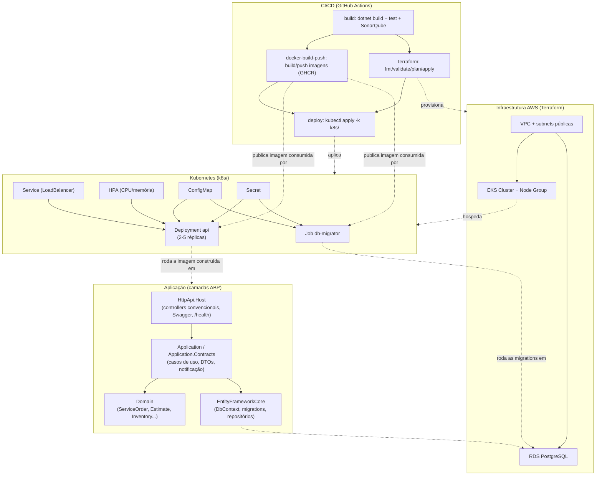

```mermaid
flowchart TB
    subgraph App["Aplicação (camadas ABP)"]
        HttpApiHost["HttpApi.Host<br/>(controllers convencionais, Swagger, /health)"]
        Application["Application / Application.Contracts<br/>(casos de uso, DTOs, notificação)"]
        Domain["Domain<br/>(ServiceOrder, Estimate, Inventory...)"]
        EfCore["EntityFrameworkCore<br/>(DbContext, migrations, repositórios)"]
        HttpApiHost --> Application --> Domain
        Application --> EfCore
    end

    subgraph Infra["Infraestrutura AWS (Terraform)"]
        VPC["VPC + subnets públicas"]
        EKS["EKS Cluster + Node Group"]
        RDS["RDS PostgreSQL"]
        VPC --> EKS
        VPC --> RDS
    end

    subgraph K8s["Kubernetes (k8s/)"]
        Deploy["Deployment api<br/>(2-5 réplicas)"]
        Svc["Service (LoadBalancer)"]
        HPA["HPA (CPU/memória)"]
        Job["Job db-migrator"]
        ConfigMap["ConfigMap"]
        Secret["Secret"]
        HPA --> Deploy
        Svc --> Deploy
        ConfigMap --> Deploy
        Secret --> Deploy
        ConfigMap --> Job
        Secret --> Job
    end

    subgraph CICD["CI/CD (GitHub Actions)"]
        Build["build: dotnet build + test + SonarQube"]
        DockerPush["docker-build-push: build/push imagens (GHCR)"]
        TF["terraform: fmt/validate/plan/apply"]
        DeployJob["deploy: kubectl apply -k k8s/"]
        Build --> DockerPush
        Build --> TF
        DockerPush --> DeployJob
        TF --> DeployJob
    end

    EfCore -.-> RDS
    Deploy -. roda a imagem construída em .-> App
    Job -. roda as migrations em .-> RDS
    EKS -. hospeda .-> K8s
    DeployJob -. aplica .-> K8s
    TF -. provisiona .-> Infra
    DockerPush -. publica imagem consumida por .-> Deploy
    DockerPush -. publica imagem consumida por .-> Job
```