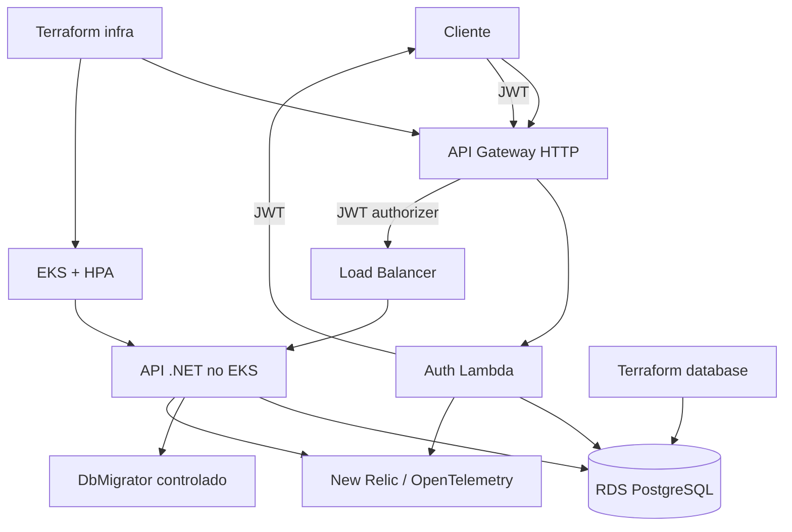

# Arquitetura-alvo

> Este documento descreve a decisão da Etapa 2. Os componentes só serão considerados implementados após provisionamento e validação.

## Responsabilidades

- `garage-management-api-dotnet`: domínio, casos de uso, endpoints, Swagger, DbContext, migrations, DbMigrator, testes e documentação central.
- `garage-management-lambda`: validação de CPF, consulta de cliente ativo, emissão de JWT, testes e deploy da função.
- `garage-management-infra`: VPC, EKS, IAM, API Gateway, Load Balancer, DNS, secrets/configuração e observabilidade de plataforma.
- `garage-management-database`: RDS, subnets privadas, security groups, backup, disponibilidade, parâmetros e outputs.

## Rotas

- Pública: autenticação por CPF.
- Pública existente: consulta pública de status, sujeita a revisão contra enumeração.
- Protegidas: clientes, veículos, produtos, serviços, estoque, orçamentos, ordens de serviço e monitoramento.
- Operacionais: `/health` e Swagger devem ter exposição controlada por ambiente.

## Token

A Lambda emite JWT com issuer, audience, subject, expiração curta e claims mínimas. O cliente possui `Customer.IsActive`, persistido por migration, e somente clientes ativos podem receber token. O Gateway autoriza rotas protegidas; a API repete a validação como defesa em profundidade. JWT, chaves privadas e secrets não aparecem em logs ou manifests versionados.

## Ambientes

`development`, `homologacao` e `producao` possuem configurações, secrets, state Terraform e endpoints separados. Valores reais serão fornecidos por secrets manager e GitHub Environments.

## Pendências de implementação

- Definir issuer/JWKS e contrato final de claims.
- Confirmar acesso privado da Lambda ao RDS.
- Provisionar API Gateway e authorizer.
- Integrar New Relic.
- Separar os repositórios sem duplicar código.
